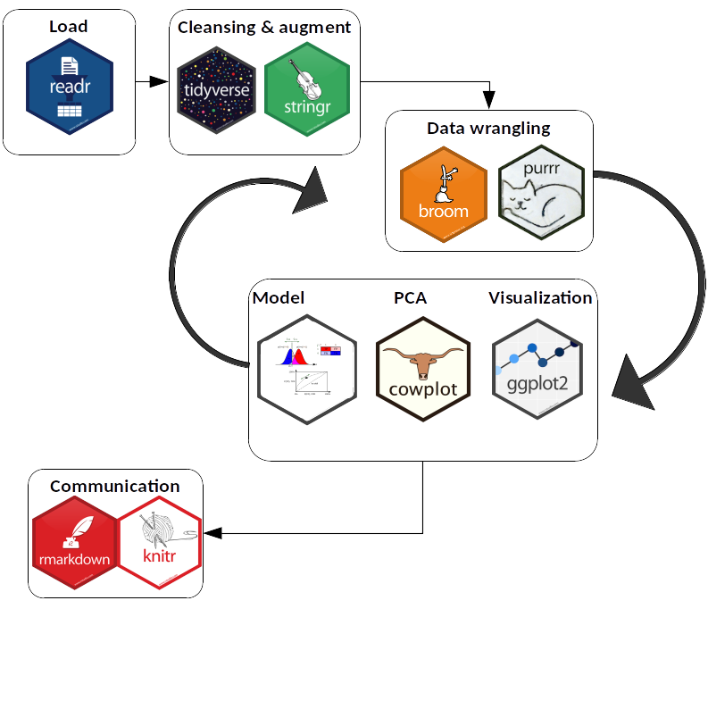

<style>
slides > slide {
color: #515151;
}
</style>

## Introduction
- Data
  - Open-source: https://doi.org/10.1371/journal.pmed.1003489
  
- Control study: PancRISK
  - Blood biomarker; plasma_CA19_9
  - Urinary biomarkers; REG1A, REG1B, LYVE1, TFF1
  - Normalization; creatinine and age
  - Diagnosis; control, benign, malignant

- Aim
  - Visual exploration
  - Urinary biomarker performance
  - Evaluation of diagnosis prediction

## Materials and Methods | Flow chart
<style>
slides > slide {
  background: linear-gradient(#ffffff, #ffffff 85%, #ffffff);
  background-color: white;
  }
</style>

<div style = "margin-top: -170px; margin-left: 100px; scale: 80%;">
```{r img-with-knitr, echo=FALSE, fig.align='center', out.extra='class="myimg"'}

```
</div>

## Materials and Methods | Data Visualization 
<div style = "margin-top: -50px">
```{r, echo = FALSE, fig.width = 9.5, fig.height = 5.5}
all_distribution
```
</div>

## Materials and Methods | Data Visualization 
```{r, echo=FALSE, fig.width = 9.5}
violin_plot + plot_annotation(
  title = "The levels of the 3 biomarkers in control, benign, and pancreatic ductal adenocarcinoma (PDAC) samples. " ,
  subtitle = "Violin plots are shown for each protein. All data were creatinine normalised ",
  caption= "Data from Silvana Debernardi et al" ) +  
  theme(legend.position = 'none')
```


## Materials and Methods | Data modelling

- 1:1 Training- and validation-set split
- Seperate/Multinomial logistic regression (glm)
<br/><br/>
- Candidate 1: binary plasma CA19_9 (cutoff 37 U/ml)
- Cand. 2 (Old panel): REG1A, LYVE1, TFF1; corrected for age and creatinine
- Cand. 3 (without plasma): REG1B, LYVE1, TFF1; corrected for age and creatinine
- Cand. 4 (PancRISK): REG1B, LYVE1, TFF1 and binary plasma CA19_9; corrected for age and creatinine


## Results | PCA & K-means
<style>
slides > slide {
  background: linear-gradient(#ffffff, #ffffff 85%, #ffffff);
  background-color: white;
  }
</style>
<div style = "margin-top: -50px">
```{r, echo = FALSE,warning = FALSE, message = FALSE, fig.width = 9.5, fig.height = 5.5}

knitr::opts_chunk$set(warning = FALSE, message = FALSE)

diagnosis_PCA <- (Data_onto_PCA_plot + cumulative_variance_plot)+ 
  plot_annotation(title = "Principal Component Analysis of PancRISK diagnosis")


kmeans_plot_ <- ( blood_diagnosis_plot_ | urinary_diagnosis_plot_)+
  plot_annotation(title = "Comparison between Blood vs Urinary biomarkers in classification of diagnosis and cancer stages",
                  caption = "Data from Silvana Debernardi et al")+ 
  theme( legend.position = "left")

(diagnosis_PCA /kmeans_plot_)
 

```
</div>

## Results | Data modelling
<style>
slides > slide {
  background: linear-gradient(#ffffff, #ffffff 85%, #ffffff);
  background-color: white;
  }
  
</style>
<div style = "margin-top: -40px; margin-left: -40px;">
```{r, fig.width = 12, fig.height = 5.2, echo = FALSE}
(plot_roc(roc1, roc2, 
          title = "Binary CA19_9",
          caption = "Used binary plasma CA19_9\nCorrected for age\nN = 390") + 
 plot_roc(roc9, roc10, 
          title = "PancRISK (Sep. regressions)",
          caption = "Used REG1B, LYVE1, TFF1 and binary plasma CA19_9\nCorrected for age and creatinine\nN = 590\nSeperate regressions for contrasts:\nControl vs. Benign and Benign vs. Malignant")) /
(plot_roc(roc5, roc6, 
          title = "PancRISK without Plasma",
          caption = "Used REG1B, LYVE1 and TFF1\ncorrected for age and creatinine\nN = 590") + 
 plot_roc(roc7, roc8, 
          title = "PancRISK (Multinomial)",
          caption = "Used REG1B, LYVE1, TFF1 and binary plasma CA19_9\nCorrected for age and creatinine\nN = 590\nMultinom regression contrast Control vs. Benign vs. Malignant"))
```
</div>

<style>
.columns-2 {
  margin-top: -1px;
}
</style>

## Results | Data modelling {.columns-2}

<div style = "background-color: #f6f6f6">
```{r, echo = FALSE}
acc_1
acc_2
acc_3
acc_4
```
</div>

## Discussion

- Blood vs Urinary biomarkers in classification
  1) Blood plasma shows importance in classification of diagnosis
  2) K-means with or without PCA performs poorly in classification

- Possible explanation:
  1) dataset contains a complex frame of attributes
  2) Patients with malignant diagnosis should be subdivided into stages
  to improve the classification performance.
  3) Other biomarkers could provide better performance